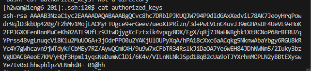

# Lab 2 Blog
Showing the three parts of LAB 2

##  Part 1

### Code:
```
import java.io.IOException;
import java.net.URI;
import java.util.ArrayList; // import the ArrayList class


class Handler implements URLHandler {
    // The one bit of state on the server: a number that will be manipulated by
    // various requests.
    int num = 0;
    ArrayList<String> answer_strings = new ArrayList<String>();
    String search = "";
    String retString = "";

    public String handleRequest(URI url) {
    if (url.getPath().equals("/")) {
        retString = "";
        num = 0;
        for (String answer : answer_strings){
            num ++;
            retString+= (String.valueOf(num)+"." +" " +answer + "\n");
            
        }
        return String.format("%s", retString);
        
        }  else {
            if (url.getPath().contains("/add-message")) {
                String[] parameters = url.getQuery().split("=");
                //if (parameters[0].equals("count")) {
                //    num += Integer.parseInt(parameters[1]);
                //    return String.format("Number increased by %s! It's now %d", parameters[1], num);
                //}
                //anser strings
                if (parameters[0].equals("s")) {
                    answer_strings.add(parameters[1]);
                    return String.format("answer_strings added by %s! It's now %s", parameters[1], answer_strings);
                }
            }
           
        } 
        return "404 Not Found!";
    }
}


class NumberServer {
    public static void main(String[] args) throws IOException {
        if(args.length == 0){
            System.out.println("Missing port number! Try any number between 1024 to 49151");
            return;
        }

        int port = Integer.parseInt(args[0]);

        Server.start(port, new Handler());
    }
}


```
Results:    
    

Note:
    The method handleRequest was called in my code. The relevant argument to that method is the url that is being called. The url contains the path and arguments from that path. IN this case the path would be towards the /add-message page and the arguments are given by ?s=hello. It will create a string array to cut up the arguments which will be used to identify what strings to store. It will then add the appropriate string to the arraylist answerStrings which is a field in this class that is used to store the messages.

Results:
    

Note:
    The method handleRequest was called in my code. The relevant argument to that method is the url that is being called. The url contains the path and arguments from that path. IN this case the path would be towards the /add-message page and the arguments are given by ?s=How%20Are%20You. It will create a string array to cut up the arguments which will be used to identify what strings to store. It will then add the appropriate string to the arraylist answerStrings which is a field in this class that is used to store the messages. 


## Part2


Results:    
    
    
    


Note:
    Shows the path files to the private and public keys. Also shows the login without a password.


## Part 3


Summary:
    I found out about how ssh works with public and private keys. I never thought about how they authenticated the logins but after these labs, I learned alot more about how public and private keys work. I can send the public key to the ssh and use my private key to login that no one else has. 


